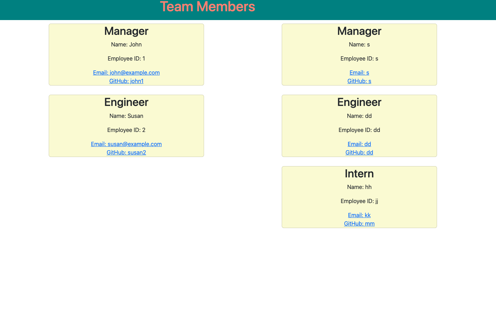

# team-profile-generator
This is a command-line application that prompts the user to enter information about their team members (Manager, Engineer or Intern) and generates an HTML page that displays a summary of each team member's information.

# Video Walkthrough 
[Video Walkthrough](https://youtu.be/v9x_t-zrWwI)
# Mock-up image

# Installation 
* Clone the repository from Github.
* npm i
# License
This project is licensed under the MIT License.
